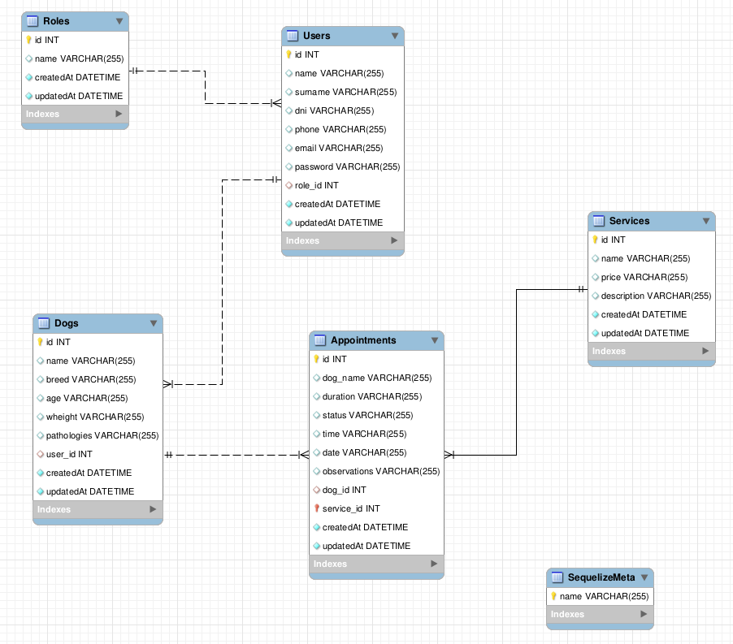

# Proyecto final - Sistema de Gestión de Citas para una Residencia canina
<details>
  <summary>Contenido 📝</summary>
  <ol>
    <li><a href="#sobre-el-proyecto">Sobre el proyecto</a></li>
    <li><a href="#diagrama-er">Diagrama Entidad Relación</a></li>
    <li><a href="#tecnologías-utilizadas">Stack - Tecnologías utilizadas</a></li>
    <li><a href="#instalación-en-local">Instalación en local</a></li>
    <li><a href="#endpoints">Endpoints</a></li>
    <li><a href="#contribuciones">Contribuciones</a></li>
  </ol>
</details>

## Sobre el proyecto
Esta API ha sido desarrollada por **Jesús Vázquez Muñoz**, como parte del proyecto final del **Bootcamp de Full Stack Developer de Geekshubs Academy**, el cuál se basa en el diseño del backend de una aplicación. El cuál es totalmente funcional y se puede realizar consultas mediante POSTMAN.

## Diagrama ER


## Tecnologías utilizadas
- Express
- Node.js
- Javascript
- Docker
- Mysql
- Postman
- JWT
- GitHub
- Git

## Instalación en local
1. Clonar el repositorio
2. ` $ npm install `
3. Conectamos nuestro repositorio con la base de datos
4. Ejecutamos las migraciones
` $ sequelize db:migrate `
5. Ejecutamos los seeders
` $ sequelize db:seed:all `
6. Levantamos el servidor de express
` $ npm run dev `

## Endpoints

Actualmente los siguientes endpoints han sido implementados y probados con éxito:

#### Endpoints relacionados con Appointments:

- POST /appointment - Crear una cita.
- GET /appointment/getAllAppointments - Obtener todas las citas.
- PUT /appointment/update/:id - Actualizar una cita por su ID.
- DELETE /appointment/delete/:id - Eliminar una cita por su ID.
- GET /appointment/getAppointment/:dogName - Obtener una cita por el nombre del perro.
- GET /appointment/dog/:dogId - Obtener una cita por el ID del perro.

#### Endpoints relacionados con Auth (Autenticación y Registro):

- POST /auth/register - Registrar un nuevo usuario.
- POST /auth/login - Iniciar sesión.

#### Endpoints relacionados con Dogs:

- POST /dog/register - Registrar un nuevo perro.
- DELETE /dog/delete/:id - Eliminar un perro por su ID.
- PUT /dog/profile/:id - Actualizar los detalles de un perro por su ID.
- GET /dog/getAllDogs - Obtener todos los perros.
- GET /dog/getAllDogsByUserId - Obtener todos los perros asociados a un usuario.

#### Endpoints relacionados con Services:

- POST /service/register - Registrar un nuevo servicio.
- GET /service/getAllServices - Obtener todos los servicios.
- PUT /service/update/:id - Actualizar un servicio por su ID.
- DELETE /service/delete/:id - Eliminar un servicio por su ID.

#### Endpoints relacionados con Users:

- GET /user/getAllUsers - Obtener todos los usuarios.
- PUT /user/profile/:id - Actualizar los detalles del perfil de un usuario por su ID.
- GET /user/getUserByDni/:dni - Obtener un usuario por su DNI.
- GET /user/profile/:id - Obtener el perfil de un usuario por su ID.
- DELETE /user/profile/:id - Eliminar el perfil de un usuario por su ID.


## Contribuciones
Las sugerencias y aportaciones son siempre bienvenidas.  

Puedes hacerlo de dos maneras:

1. Abriendo una issue
2. Crea un fork del repositorio
    - Crea una nueva rama  
        ```
        $ git checkout -b feature/nombreUsuario-mejora
        ```
    - Haz un commit con tus cambios 
        ```
        $ git commit -m 'feat: mejora X cosa'
        ```
    - Haz push a la rama 
        ```
        $ git push origin feature/nombreUsuario-mejora
        ```
    - Abre una solicitud de Pull Request

## Agradecimientos
- **Dani**  
<a href="https://github.com/Datata" target="_blank"></a>

- **Mara**  
<a href="https://github.com/MaraScampini" target="_blank"></a>

- **David**  
<a href="https://www.github.com/Dave86dev" target="_blank"></a>